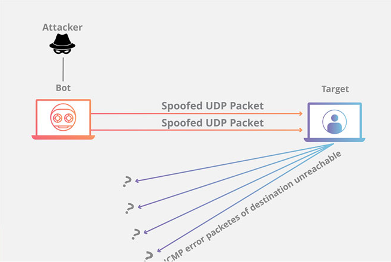
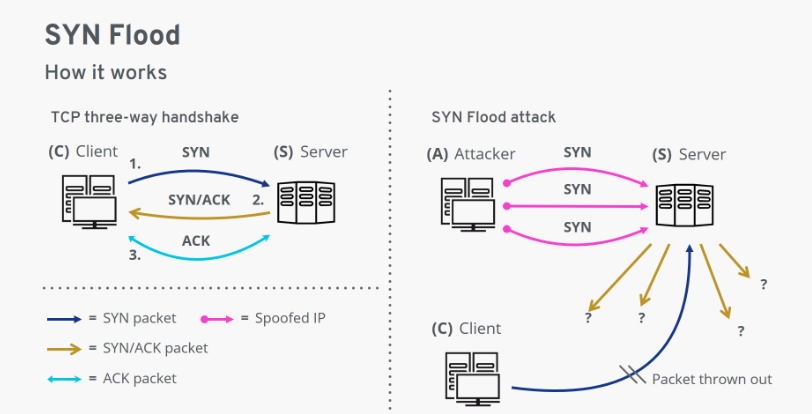

# Tìm hiểu về tấn công ddos và cách phòng chống


> Sinh viên: Đinh Văn Tuấn (sv_tuandv@viettelcyber.com)
>
> Phòng ANHTUD


### 1. Tìm hiểu về tấn công DDOS và cách phòng chống

Tấn công DDoS (Distributed Denial of Service) là một hình thức tấn công mạng nhằm làm ngập tràn lưu lượng mạng đến một trang web hoặc hệ thống máy chủ, khiến cho người dùng bình thường không thể truy cập được vào trang web hoặc hệ thống đó.

Tấn công DDoS thường được thực hiện bằng cách sử dụng một mạng máy tính zombie được kiểm soát từ xa bởi các hacker, được gọi là botnet. Botnet được điều khiển bởi các hacker thông qua các kết nối mạng không ổn định hoặc các máy tính bị nhiễm virus, malware.

Khi tấn công DDoS xảy ra, botnet sẽ gửi hàng ngàn hoặc hàng triệu yêu cầu truy cập đến một trang web hoặc hệ thống máy chủ, gây ra tình trạng quá tải và khiến cho trang web hoặc hệ thống đó không thể hoạt động đúng cách. Tấn công DDoS là một trong những hình thức tấn công mạng nguy hiểm và phổ biến nhất hiện nay, có thể gây ra thiệt hại nghiêm trọng cho các tổ chức và doanh nghiệp trên toàn thế giới.

#### Các loại tấn công DDOS phổ biến

Dưới đây là một số kiểu tấn công DDoS phổ biến:

##### 	1) **NTP Flood (NTP Amplification)**

Network Time Protocol (NTP), một trong những giao thức mạng lâu đời nhất được giao nhiệm vụ đồng bộ hóa thời gian giữa các hệ thống điện tử là cốt lõi của DDoS attack vector. Cách thức thực hiện là khai thác lỗ hổng các máy chủ NTP có thể truy cập công khai để làm quá tải mạng đích với số lượng lớn các gói UDP.

##### 	2)  **Fraggle Attack**

Kỹ thuật DDoS này về logic tương tự như Smurf Attack, ngoại trừ việc nó tấn công nạn nhân dự định bằng nhiều gói UDP thay vì các gói tin ICMP request.

##### 	3) **SYN-ACK Flood**

Theo logic đây là kiểu tấn công vector lợi dụng giao tiếp TCP trong đó máy chủ tạo ra gói tin SYN-ACK để xác nhận yêu cầu của user. Để thực hiện tấn công Hacker đã làm quá tải tài nguyên CPU RAM của máy chủ bằng cách gửi các gói tin SYN-ACK giả mạo.

##### 	4) **ACK & PUSH ACK Flood**

Giao thức TCP yêu cầu giao thức bắt tay ba bước khi thiết lập kết nối giữa máy chủ và máy khách các gói ACK hoặc PUSH ACK được gửi qua lại cho đến khi phiên làm việc kết thúc. Máy chủ bị tấn công dạng này sẽ không thể xác định nguồn gốc của các gói tin bị làm sai lệch địa chỉ và máy chủ lúc đó sẽ lãng phí khả năng xử lý khi cố gắng xác định cách xử lý chúng.

##### 		5) **Fragmented ACK Flood**

 Cuộc tấn công này là một knockoff của kỹ thuật ACK & PUSH ACK Flood đã đề cập ở trên. Nó tập trung vào việc xóa một mạng đích với số lượng gói ACK bị phân mảnh tương đối nhỏ, có kích thước tối đa được phép, thường là 1500 byte mỗi gói. Các thiết bị mạng như bộ định tuyến cũng sẽ hết tài nguyên khi cố gắng lắp ráp lại các gói này. Hơn nữa, các gói bị phân mảnh có thể vượt qua radar của các hệ thống ngăn chặn xâm nhập (IPS) và Firewall.

##### 	6) **UDP Flood**



UDP (User Datagram Protoncal) là một giao thức kết nối không tin cậy. Một cuộc tấn công gây ngập băng thông UDP có thể được bắt đầu bằng cách gửi một số lượng lớn các gói tin UDP tới cổng ngẫu nhiên trên một máy chủ từ xa và kết quả là các máy chủ sẽ:

+ Kiểm tra ứng dụng với các cổng
+ Thấy rằng không có ứng dụng nghe ở cổng
+ Trả lời với một gói ICMP Destination Unreachable

Khi số lượng request vượt ngưỡng này sẽ đẫn đến mất khả năng sử lý các yêu cầu của khách hàng thông thường đẫn đến tình trạng từ chối dịch vụ.

UDP là một giao thức không duy trì trạng thái, và trong các gói tin UDP sẽ có thông nguồn IP máy chủ dịch phản hồi yêu cầu. Lợi dụng đặc tính này hacker không sử dụng IP thật mà sẽ thay thế bằng IP giả. Trường hợp này sẽ rất khó để xác định được nguồn tấn công thực sự.

##### 	7) DNS Flood

Đây là một biến thể của UDP Flood mục tiêu tập trung vào các máy chủ DNS. Hacker tạo ra một loạt các gói yêu cầu DNS giả giống như các gói hợp pháp bắt nguồn từ một số lượng lớn các địa chỉ IP khác nhau. DNS Flood là một trong những kiểu tấn công từ chối dịch vụ khó nhất để ngăn chặn và khôi phục.

##### 	8) SYN Flood



Cuộc tấn công này khai thác giao thức bắt tay ba bước TCP, một kỹ thuật được sử dụng để thiết lập bất kỳ kết nối nào giữa client với server. Thông thường client gửi một message SYN (đồng bộ hóa) đến máy chủ để yêu cầu kết nối.
Khi một cuộc tấn công SYN Flood diễn ra, hacker sẽ gửi rất nhiều message từ một địa chỉ IP giả mạo. Kết quả là server không còn khả năng xử lý vì lưu trữ rất nhiều gói SYN và xảy ra tình trạng từ chối dịch vụ cho các client thực.

##### 	9) **HTTP Flood**


Khi thực hiện một cuộc tấn công DDoS HTTP Flood, Hacker sẽ gửi các yêu cầu GET hoặc POST hợp pháp đến máy chủ hoặc ứng dụng web và tiêu tốn hầu hết hoặc tất cả các tài nguyên của nó. Kỹ thuật này thường liên quan đến các botnet được tạo ra bởi Hacker trước đó bằng cách lây nhiễm các phần mềm độc hại.

##### 	10) **ICMP Flood**

Còn được gọi là Ping Flood, cuộc tấn công này nhằm mục đích làm quá tải sức xử lí của máy chủ hoặc thiết bị mạng khác với nhiều giao thức Message Protocol (ICMP) hoặc pings. Các thiết bị trên nhận được một số lượng ping ICMP nhất định và mạng phản hồi với cùng số gói trả lời. Vì khả năng đáp ứng này là hữu hạn nên mạng sẽ sớm rơi vào tình trạng từ chối dịch vụ.

##### 	11) **Ping of Death Attack**


Ping of Death là kỹ thuật tấn công làm quá tải hệ thống mạng bằng cách gửi các gói tin ICMP có kích thước vượt quá 65.536 byte đến mục tiêu. Do kích thước này lớn hơn kích thước cho phép của các gói tin IP nên nó sẽ được chia nhỏ ra rồi gửi từng phần đến máy đích. Khi đến mục tiêu, nó sẽ được ráp lại thành gói tin hoàn chỉnh, do có kích thước quá mức cho phép, nó sẽ gây ra tràn bộ nhớ đệm và bị treo.

Theo một báo cáo kỹ thuật được công bố trong tuần này, kỹ thuật tấn công BlackNurse còn được biết đến dưới một cái tên truyền thống hơn: “tấn công gây lụt ping” và nó dựa trên các truy vấn ICMP Type 3 (hay lỗi Đích tới Không thể truy cập – Destination Unreachable) Code 3 (lỗi Cổng Không thể truy cập – Port Unreachable).

Được mệnh danh là kỹ thuật tấn công BlackNurse – Y Tá Đen hay tấn công tốc độ thấp “Ping of Death“, kỹ thuật này có thể được sử dụng để phát động hàng loạt cuộc tấn công từ chối dịch vụ DoS khối lượng thấp bằng cách gửi các gói tin ICMP hay các “ping” để làm ngập những bộ xử lý trên máy chủ. Ngay cả khi các máy chủ đó được trang bị những thiết bị tường lửa nổi tiếng, chúng vẫn có thể bị đánh gục nếu kẻ tấn công khai thác kỹ thuật này.

Một số máy tính sẽ ngưng hoạt động, reboot hoặc bị crash khi gởi gói data ping với kích thước lớn đến chúng.

Ở kiểu DoS attack Ping of Death này , ta chỉ cần gửi một gói dữ liệu có kích thước lớn thông qua lệnh ping đến máy đích thì hệ thống của họ sẽ bị treo.

##### 	12) Slowloris

Kẻ tấn công sẽ gửi đến webserver nhiều yêu cầu http request không hoàn chỉnh và cố gắng duy trì tối đa số kết nối có thể đạt được. Cho đến số kết nối của webserver đạt ngưỡng, nó bắt đầu từ chối những kết nối request gửi đến bao gồm cả request của người dùng. Mỗi kết nối sẽ được duy trì đến khi time-out thì sẽ cắt kết nối đó, và trả lại tài nguyên để webserver sẵn sàng nhận kết nối mới. Tuy nhiên, khi mà kẻ tấn công vẫn đang dùng Http Slowloris thì webserver sẽ liên tục bị đầy kết nối, từ đó gây ra hiện tựơng từ chối dịch vụ webserver.


**Cách phòng chống tấn công DDOS hiệu quả hiện nay:**

1) Sử dụng Firewall: Cấu hình firewall để chặn các gói tin đến từ các địa chỉ IP đáng ngờ hoặc bị nghi ngờ, hoặc đặt giới hạn truy cập cho các địa chỉ IP để giảm thiểu rủi ro tấn công DDoS.
2) Sử dụng Load balancer: Load balancer giúp phân phối tải trọng giữa các server, giúp giảm thiểu tác động của tấn công DDoS đối với một server cụ thể.
3) Tăng khả năng chịu tải: Cung cấp băng thông rộng hơn, tăng số lượng server, tối ưu hóa cấu hình hệ thống, đều có thể giúp gia tăng khả năng chịu tải của hệ thống, giảm thiểu tác động của tấn công DDoS.
4) Sử dụng các dịch vụ chống DDoS: Các dịch vụ bảo mật của nhà cung cấp dịch vụ điện toán đám mây (Cloud) như Amazon Web Services, Google Cloud Platform, Microsoft Azure cung cấp tính năng bảo vệ chống DDoS.
5) Điều chỉnh DNS TTL (Time To Live): TTL quy định thời gian mà một bản ghi DNS được lưu trong bộ nhớ cache của các DNS resolver trên toàn thế giới. Việc giảm TTL có thể giúp giảm thiểu tác động của tấn công DDoS.

Tuy nhiên, không có giải pháp nào là hoàn hảo để chống lại tấn công DDoS. Vì vậy, để tăng cường bảo mật, nên thường xuyên cập nhật và nâng cấp hệ thống, đồng thời cũng cần xây dựng kế hoạch phòng chống tấn công DDoS chi tiết và cập nhật liên tục.


**Cách phòng chống các loại tấn công DDOS cụ thể:** 

##### 	a) Syn flood:

Các cơ chế Syn Cookie, Syn Cache và Syn Proxy đều được thiết kế để giảm thiểu tác động của cuộc tấn công Syn Flood bằng cách bảo vệ các máy chủ khỏi quá tải và giảm thiểu thời gian đáp ứng.

Dưới đây là một số ưu và nhược điểm của từng cơ chế:

| STT  |              | Ưu điểm                                                      | Nhược điểm                                                   |
| ---- | ------------ | ------------------------------------------------------------ | ------------------------------------------------------------ |
| 1    | *Syn Cookie* | Syn Cookie được coi là một cách tiết kiệm tài nguyên máy chủ tốt nhất trong số ba phương pháp, do đó nó được ưa chuộng hơn | Syn Cookie có thể bị tấn công bằng cách sử dụng các kỹ thuật giả mạo IP đích hoặc giả mạo cờ TCP, tuy nhiên, điều này không phải là một vấn đề lớn |
| 2    | *Syn Cache*  | Syn Cache cho phép máy chủ lưu trữ thông tin về các kết nối đã được thiết lập để xác nhận trạng thái của các kết nối mới. Việc này giúp giảm tải cho máy chủ và tăng tốc độ đáp ứng | Syn Cache có thể bị tấn công bằng cách sử dụng các kỹ thuật giả mạo IP đích hoặc giả mạo cờ TCP |
| 3    | *Syn Proxy*  | Syn Proxy cung cấp khả năng bảo vệ tốt nhất trong số ba phương pháp. Các máy chủ proxy có thể giúp giảm tải cho các máy chủ chính và bảo vệ chúng khỏi các cuộc tấn công DDOS | Tuy nhiên, Syn Proxy cần sử dụng các máy chủ trung gian để xử lý các kết nối TCP, do đó, việc triển khai Syn Proxy sẽ tốn nhiều tài nguyên hơn so với hai cơ chế còn lại |

Mỗi cơ chế Syn Cookie, Syn Cache và Syn Proxy đều có những ưu và nhược điểm riêng của nó. Tùy thuộc vào nhu cầu và tài nguyên của tổ chức, các cơ chế này có thể được triển khai một cách phù hợp để giảm thiểu tác động của tấn công Syn Flood.

##### 	b) http flood:

- ​	**Nginx** là một máy chủ web hoặc reverse proxy server được sử dụng phổ biến để giảm thiểu tác động của các cuộc tấn công HTTP Flood. Nó có thể xử lý hàng nghìn yêu cầu đồng thời và phân phối lưu lượng truy cập đến nhiều máy chủ web hoặc ứng dụng, giúp giảm thiểu quá tải cho các máy chủ chính.
- **Reverse proxy** là một dạng proxy server được sử dụng để giảm tải cho các máy chủ chính bằng cách chuyển tiếp yêu cầu từ người dùng đến máy chủ phía sau. Nó còn được sử dụng để cải thiện độ bảo mật và quản lý lưu lượng truy cập.
- **Module testcookie** là một module của Nginx được sử dụng để phát hiện các cuộc tấn công HTTP Flood bằng cách kiểm tra các yêu cầu từ người dùng và xác định xem chúng có phải là yêu cầu hợp lệ hay không. Nếu yêu cầu không hợp lệ, module testcookie sẽ chuyển hướng yêu cầu đến một trang bị cấm hoặc một trang thông báo lỗi. Module này giúp giảm thiểu tác động của các cuộc tấn công HTTP Flood và bảo vệ các máy chủ web hoặc ứng dụng khỏi quá tải và sụp đổ.

Tóm lại, để bảo vệ các máy chủ web hoặc ứng dụng khỏi các cuộc tấn công HTTP Flood, Nginx là một giải pháp hiệu quả để giảm tải cho các máy chủ chính. Reverse proxy và module testcookie là hai tính năng quan trọng của Nginx để giảm thiểu tác động của các cuộc tấn công HTTP Flood và bảo vệ các máy chủ web hoặc ứng dụng.


##### c) Slowloris

Slowloris là một loại tấn công mạng phổ biến, nó được sử dụng để làm chậm hoặc làm ngừng hoạt động các máy chủ web. Điều này đặc biệt ảnh hưởng đến máy chủ Apache, vì Apache có thể xử lý các yêu cầu đồng thời nhưng không kiểm soát được tốc độ kết nối.

Slowloris hoạt động bằng cách tạo ra nhiều kết nối đến máy chủ web mục tiêu và giữ chúng mở bằng cách gửi các yêu cầu HTTP không đầy đủ, với các header không hoàn chỉnh hoặc một phần của nội dung. Khi máy chủ nhận được các yêu cầu này, nó sẽ giữ kết nối mở và chờ đợi nhận được yêu cầu hoàn chỉnh trước khi xử lý yêu cầu. Khi số lượng kết nối tăng lên, tài nguyên của máy chủ sẽ bị quá tải và nó sẽ không còn phản hồi các yêu cầu từ người dùng hợp lý.

Để phòng chống tấn công Slowloris, các quản trị viên có thể thực hiện các biện pháp sau:

1. Cập nhật phiên bản Apache: Apache 2.2.15 trở lên có tính năng "Timeout" để giới hạn thời gian một kết nối được giữ mở. Điều này giúp giảm thiểu tác động của các cuộc tấn công Slowloris.
2. Sử dụng mod_reqtimeout: Đây là một module của Apache được sử dụng để giới hạn thời gian chờ đợi cho các yêu cầu HTTP không đầy đủ. Module này giúp giảm thiểu tác động của các cuộc tấn công Slowloris bằng cách đóng kết nối nếu yêu cầu không hoàn chỉnh được gửi trong khoảng thời gian nhất định.
3. Sử dụng một giải pháp bảo vệ WAF: Một giải pháp bảo vệ WAF (Web Application Firewall) có thể giúp ngăn chặn các cuộc tấn công Slowloris bằng cách lọc các yêu cầu không hợp lệ.
4. Tăng số lượng kết nối tối đa: Tăng số lượng kết nối tối đa mà máy chủ web có thể xử lý đồng thời giúp giảm thiểu tác động của các cuộc tấn công Slowloris.

để phòng chống tấn công Slowloris, các quản trị viên nên kết hợp sử dụng các biện pháp trên để tăng cường bảo mật cho máy chủ web. Ngoài ra, cần thường xuyên cập nhật phiên bản của các phần mềm, module và giải pháp bảo vệ để đảm bảo tính an toàn cho hệ thống. Đồng thời, các quản trị viên cũng nên đào tạo cho nhân viên về các mối đe dọa mạng và cách phòng chống để tăng cường hiểu biết về bảo mật thông tin.


#### Tìm hiểu iptables, các tính năng của iptables

Iptables là một công cụ quản lý tường lửa trên các hệ thống Linux. Nó cho phép người dùng quản lý các quy tắc truy cập vào hệ thống từ các IP và các kết nối mạng khác nhau. Một trong những tính năng của iptables là giới hạn tốc độ tạo connection/s của 1 IP, có thể được thực hiện bằng cách sử dụng các module như match recent và hash limit.

1. Giới hạn tốc độ tạo connection/s của 1 IP:

   + Match recent: module này cho phép ta lưu trữ thông tin về các kết nối gần đây của một IP. Ta có thể sử dụng nó để giới hạn tốc độ tạo connection/s của một IP bằng cách đặt một ngưỡng (limit) về số connection được tạo trong một khoảng thời gian nhất định. Ví dụ, để giới hạn một IP chỉ có thể tạo 5 connection/s, ta có thể sử dụng lệnh sau:

     ```bash
     iptables -A INPUT -p tcp --syn --dport 80 -m recent --name SYN --set
     iptables -A INPUT -p tcp --syn --dport 80 -m recent --name SYN --update --seconds 1 --hitcount 5 -j DROP
     ```

   

   + Hash limit: module này cũng cho phép giới hạn tốc độ tạo connection/s của một IP bằng cách sử dụng một bảng hash để lưu trữ thông tin về các kết nối. Ta có thể sử dụng lệnh sau để giới hạn một IP chỉ có thể tạo 10 connection/s:

     ```bash
     iptables -A INPUT -p tcp --dport 80 -m hashlimit --hashlimit-above 10/sec --hashlimit-mode srcip --hashlimit-name http -j DROP
     ```

2. Giới hạn concurrent connection hiện tại của 1 IP:

   Match connlimit: module này cho phép ta giới hạn số lượng kết nối hiện tại đến một cổng cụ thể từ một địa chỉ IP. Ta có thể sử dụng lệnh sau để giới hạn một IP chỉ có thể có tối đa 20 kết nối đồng thời đến cổng 80:

   ```bash
   iptables -A INPUT -p tcp --syn --dport 80 -m connlimit --connlimit-above 20 --connlimit-mask 32 -j DROP
   ```


### 2. Xây dựng 1 hệ thống chống tấn công DDOS cơ bản

Để dựng một hệ thống reverse proxy kết hợp các thành phần để chống tấn công DDoS:

1. Syn cookie để chống syn flood: Sử dụng tính năng syn cookie của iptables để giảm thiểu hiệu ứng của tấn công Syn flood. Điều này cho phép server hoạt động như bình thường và chỉ đánh dấu các gói tin Syn tràn để từ chối chúng. Để sử dụng tính năng này, cần đảm bảo rằng tính năng syn cookie được bật trên server.
2. Iptables để giới hạn tốc độ connection: Sử dụng iptables để giới hạn số lượng kết nối mỗi giây đến server. Có thể sử dụng module iptables hashlimit để thực hiện việc này. Module này giới hạn số lượng kết nối đến server bằng cách theo dõi số lượng kết nối và đưa ra quyết định từ chối kết nối nếu số lượng vượt quá giới hạn đã định sẵn.
3. Nginx để chống tấn công http flood, slowloris: Sử dụng Nginx như một reverse proxy để chống tấn công HTTP flood và Slowloris. Có thể sử dụng module Nginx Testcookie để giám sát lưu lượng truy cập và ngăn chặn các yêu cầu đáng ngờ. Ngoài ra cũng có thể sử dụng các tính năng của Nginx như *limit_req_zone, limit_req* và *limit_conn* để giới hạn số lượng yêu cầu đến server và giảm thiểu ảnh hưởng của tấn công DDoS.
